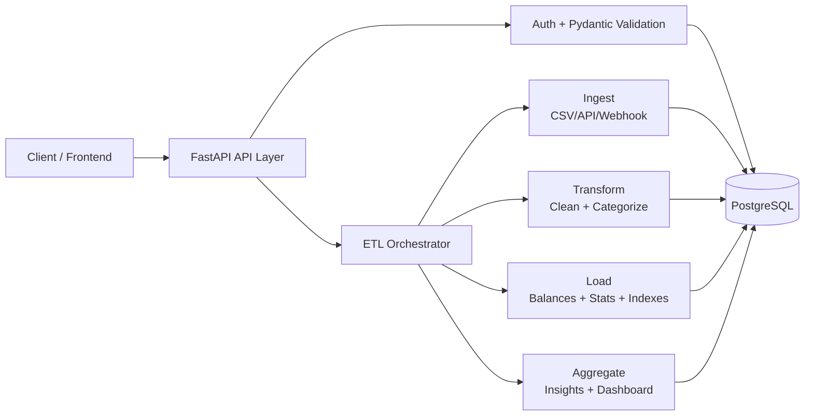

# Fin-Pulse

Production-style personal finance backend built with FastAPI, SQLAlchemy, and PostgreSQL.
It ingests messy transaction data from CSV/API sources, runs a full ETL pipeline, and exposes analytics-ready endpoints for dashboards, budgets, and financial insights.

[](https://python.org)
[](https://fastapi.tiangolo.com)
[](https://docs.pydantic.dev)
[](https://www.sqlalchemy.org)
[](https://www.postgresql.org)
[](https://www.docker.com)
[](https://docs.pytest.org)
[](https://github.com/features/actions)
[](https://opensource.org/licenses/Apache-2.0)

## Project structure

- Async-first backend: FastAPI + SQLAlchemy AsyncSession + async ETL orchestration.
- Real ETL architecture: `ingest -> transform -> load -> aggregate` with dedicated modules and step-level logging.
- Data quality focus: parsing/normalization for dates, amounts, merchants, categories, plus deduplication via transaction hashing.
- Security implemented: JWT auth, password hashing (bcrypt via Passlib), OAuth2 bearer flow, admin-gated health endpoint.
- Analytics depth: savings rate, budget recommendations, category spending, top merchants, monthly trend, lifetime snapshots.
- Delivery engineering: Dockerized environment, Alembic migrations, async integration tests, GitHub Actions CI.

## System Design



## Core Capabilities

- Account management for authenticated users (create/read/update/delete).
- Transaction ingestion from:
  - direct API request body,
  - CSV uploads,
  - external API fetch flow,
  - webhook-ready ingest helper.
- Full ETL runs and independent step execution (`/transform-only`, `/load-only`, `/aggregate-only`).
- Operational introspection:
  - pipeline status (`/etl/status`),
  - admin health check (`/etl/health`),
  - structured per-step execution logs.
- Analytics endpoints for dashboard-ready payloads and account summaries.

## API Surface

| Domain | Endpoints |
|---|---|
| Auth | `POST /profile/login` |
| Accounts | `GET /accounts`, `POST /accounts`, `PATCH /accounts/{account_id}`, `DELETE /accounts/{account_id}` |
| Transactions | `POST /transactions`, `POST /transactions/upload-csv`, `GET /transactions/raw` |
| ETL | `POST /etl/run-csv`, `POST /etl/run-api`, `POST /etl/transform-only`, `POST /etl/load-only`, `POST /etl/aggregate-only`, `GET /etl/status`, `GET /etl/health` |
| Analytics | `GET /analytics/dashboard`, `GET /analytics/spending-by-category`, `GET /analytics/budget-recommendations`, `GET /analytics/user-stats`, `GET /analytics/account-summary` |

## Data Modeling Highlights

- `users_table`: identity, role, authentication ownership root.
- `accounts`: provider/currency/balance with owner relationship.
- `transactions`: raw + normalized fields, ETL state, dedupe hash, source metadata.
- `user_stats`: cached aggregate metrics for fast dashboard responses.
- Performance-aware indexing for frequent patterns:
  - `owner_id + processed`,
  - `owner_id + created_at`,
  - category/account/date access paths,
  - text search GIN index for descriptions.

## ETL Pipeline Internals

### 1) Ingest
- Normalizes CSV/API/webhook payloads into a standard transaction shape.
- Handles encoding fallbacks and mixed source field names.
- Generates SHA-256 transaction hash for deduplication.

### 2) Transform
- Parses multi-format dates and flexible amount formats.
- Normalizes merchants and auto-categorizes transactions.
- Marks records as `processed=True` after successful cleaning.

### 3) Load
- Recomputes account balances from processed transactions.
- Builds/ensures performance indexes.
- Validates data consistency and updates cached `user_stats`.

### 4) Aggregate
- Produces monthly trend, category spend, top merchants, savings rate.
- Generates actionable financial insights and budget recommendations.
- Returns consolidated dashboard payload for frontend consumption.

## Tech Stack

- Backend: FastAPI, Starlette, Uvicorn
- Validation: Pydantic v2 (`BaseModel`, enums, typed response models)
- ORM/DB: SQLAlchemy 2.0 async, PostgreSQL, psycopg
- Migrations: Alembic (auto-upgrade on app startup)
- Security: JWT (PyJWT), OAuth2PasswordBearer, Passlib bcrypt
- ETL: modular async pipeline in `app/core/etl/*`
- Testing: `pytest`, `pytest-asyncio`, `httpx` ASGI integration tests
- Platform: Docker, Docker Compose, GitHub Actions

## Local Development

### Prerequisites

- Docker + Docker Compose

### Environment Variables

Create `.env` in project root:

```env
DATABASE_URL=postgresql+psycopg://<user>:<password>@localhost:<port>/<db_name>
SECRET_KEY=<your-secret-key>
ALGORITHM=HS256
ACCESS_TOKEN_EXPIRE_MINUTES=30
```

### Run with Docker

```bash
docker compose up --build
```

API docs:
- Swagger UI: `http://localhost:8000/docs`
- ReDoc: `http://localhost:8000/redoc`

### Run Tests

```bash
docker compose up --build -d
docker compose exec -T api pytest -v
```

## Test Strategy

- Async integration tests run against FastAPI app via `httpx` + `ASGITransport`.
- Isolated test database session with fixture-based setup/teardown.
- Coverage includes:
  - authentication behavior,
  - account CRUD,
  - transaction ingest (JSON + CSV),
  - ETL orchestration and role-based health checks,
  - analytics endpoints and dashboard shape.

Current suite: `19` async API tests across `auth`, `accounts`, `transactions`, `etl`, and `analytics`.

## CI Pipeline

GitHub Actions workflow (`.github/workflows/tests.yml`) runs on every push and pull request:

- boots PostgreSQL with Docker Compose,
- creates test database,
- builds and starts API container,
- runs `pytest -v`,
- prints container logs on failures.

## Dockerized Runtime

- `db` service: PostgreSQL 15 (`5433 -> 5432`)
- `api` service: FastAPI app served by Uvicorn (`8000 -> 8000`)
- persistent DB volume for local state (`postgres_data`)

## Project Structure

```text
app/
  api/
    endpoints/         # auth, accounts, transactions, etl, analytics
  core/
    etl/               # ingest, transform, load, aggregate, pipeline
    models.py          # SQLAlchemy models
    schemas.py         # Pydantic schemas
    security.py        # JWT + password hashing + role validation
  main.py              # FastAPI app + lifespan migration hook
tests/                 # async integration tests
migrations/            # Alembic schema versions
docker-compose.yml
dockerfile
```

## Roadmap

- Complete AI query assistant in `app/ai_feature/`:
  - semantic retrieval,
  - SQL safety guardrails,
  - deterministic analytics explanation layer.
- Add refresh-token flow and user registration endpoint.
- Add observability (structured logs + metrics export).

## License

Apache 2.0
